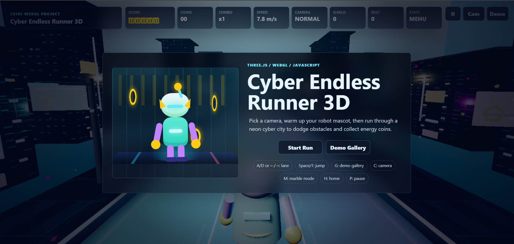
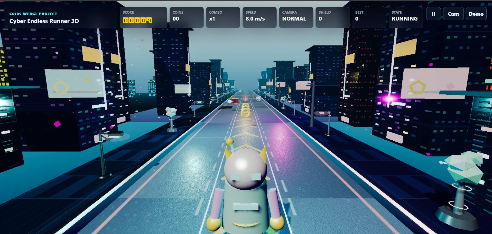
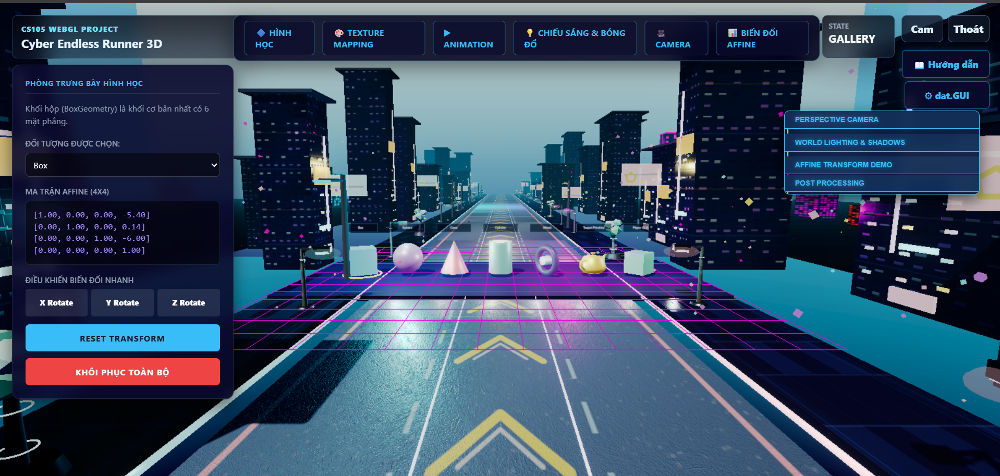

<div align="center">

# 🌆 Cyber Endless Runner 3D


*Đồ án môn Đồ Họa Máy Tính (CS105.Q22) — Three.js / WebGL*

[](https://opensource.org/licenses/MIT)


<br/>


<p><em>🎮 Gameplay</em></p>

</div>

---

## 🌐 Giới thiệu

**Cyber Endless Runner 3D** là một trò chơi đua xe vô tận *(endless runner)* chạy hoàn toàn trên trình duyệt, được xây dựng bằng **Three.js** và **WebGL thuần**. Bối cảnh là một thành phố Cyberpunk không ngủ — nơi những tòa cao ốc phát sáng neon xanh/hồng/vàng vút lên bầu trời gradient, những con đường chạy dài vô tận dưới chân robot mascot của bạn.

Dự án được phát triển như một **đồ án môn Đồ Họa Máy Tính**, với mục tiêu chứng minh toàn bộ pipeline đồ họa 3D: từ việc dựng cảnh thủ công bằng primitive geometry, áp dụng Phong Lighting Model, shadow mapping cho đến post-processing bloom và custom GLSL shader. Thay vì một demo khô khan, toàn bộ kỹ thuật học thuật được đặt trong một **vòng gameplay thực sự** — robot chạy, nhảy, né chướng ngại vật và thu thập năng lượng giữa một thành phố neon sống động.

---

## 📸 Hình ảnh Demo

<div align="center">
  <table>
    <tr>
      <td align="center">
        
        <br><em>🏠 Màn hình chính</em>
      </td>
      <td align="center">
        
        <br><em>🎮 Chế độ Gameplay</em>
      </td>
    </tr>
    <tr>
      <td align="center" colspan="2">
        
        <br><em>🖼️ Phòng Trưng Bày Hình Học (Demo Gallery)</em>
      </td>
    </tr>
  </table>
</div>

---

## ✨ Tính năng nổi bật

### 🎓 Academic Core (Đồ họa học thuật)

* **Primitive Geometry**: Xây dựng toàn bộ từ các khối cơ bản như Box, Sphere, Cone, Cylinder, Torus, Tetrahedron, Octahedron, Dodecahedron, Icosahedron và `TeapotGeometry` (Utah Teapot cổ điển).
* **GLB/GLTF Model Loading**: Hỗ trợ nạp model 3D (nhân vật robot và các chướng ngại vật) từ file `.glb` thông qua `GLTFLoader`.
* **Phong Lighting Model**: Áp dụng hệ thống chiếu sáng chuẩn với `AmbientLight`, `DirectionalLight` (giả lập mặt trời), `PointLight` (decay nghịch bình phương), và `HemisphereLight`.
* **Shadow Mapping**: Sử dụng `PCFSoftShadowMap 2048×2048` với shadow frustum tự động trượt theo vị trí người chơi để tối ưu chi phí render.
* **Affine Transforms**: Hỗ trợ tịnh tiến, xoay, tỷ lệ qua 3 kênh đồng bộ (bàn phím, chuột, dat.GUI slider) và hiển thị Ma trận 4×4 cập nhật theo thời gian thực.
* **Perspective Camera**: Tích hợp 3 preset góc nhìn khác nhau, cho phép điều chỉnh `x/y/z/fov/near/far` trực tiếp thông qua bảng dat.GUI.
* **Texture Mapping**: Hỗ trợ file ảnh thực (road, brick, hardwood), normal map vỉa hè, và tính năng upload bitmap tùy chỉnh áp lên Gallery rồi đồng bộ ngược sang gameplay.

### 🚀 Advanced Graphics & Optimization (Kỹ thuật nâng cao)

* **Unreal Bloom Post-Processing**: Cường độ bloom tự động tăng theo tốc độ game, tạo hiệu ứng thị giác ấn tượng (warp).
* **Dynamic FOV**: Góc nhìn camera tự động mở rộng theo tốc độ, tăng cảm giác "speed rush".
* **Procedural Skydome & Skyline**: Bầu trời được vẽ bằng custom GLSL shader và thành phố sinh ngẫu nhiên mỗi lần load với billboard hologram Canvas API.
* **Neon Grid Floor & GPU Instanced Dust**: Lưới neon cuộn dưới chân (custom GLSL) kết hợp hàng trăm hạt bụi neon tối ưu qua `InstancedMesh`.
* **Object Pooling**: Quản lý bộ nhớ hiệu quả bằng cách tái sử dụng (pooling) các chướng ngại vật (9 loại) và vật phẩm thu thập (Coin, Orb, Shield).
* **Reactive Lighting System**: Hệ thống ánh sáng tương tác ngay lập tức khi nhảy, ăn điểm, suýt va chạm hoặc chết; sử dụng pre-allocated `Color.lerp` để tối ưu.
* **Tone Mapping & Fog**: Sử dụng `ACESFilmicToneMapping` kết hợp `sRGBEncoding` và `FogExp2` màu teal cho màu sắc điện ảnh và chiều sâu không gian.

---

## 🛠️ Công nghệ sử dụng

| Công nghệ | Phiên bản | Vai trò |
|---|---|---|
| **Three.js** | r137 | Thư viện Render WebGL 3D lõi |
| **WebGL 2.0** | — | API đồ họa cấp thấp |
| **dat.GUI** | 0.7.9 | Xây dựng giao diện Debug & tinh chỉnh thông số |
| **Howler.js** | 2.2.4 | Quản lý và phát âm thanh (Web Audio API) |
| **TWEEN.js** | — | Hỗ trợ smooth animation tweening |
| **Webpack** | 5 | Module bundler để đóng gói mã nguồn |
| **GLTFLoader** | *Built-in* | Nạp model định dạng GLB/GLTF |
| **EffectComposer** | *Built-in* | Quản lý Post-processing pipeline (UnrealBloom) |

---

## ⌨️ Cách chơi & Điều khiển

### 🎮 Gameplay (Endless Runner)

| Phím / Thao tác | Chức năng |
|---|---|
| `A` / `D` hoặc `←` / `→` | Đổi làn đường (Trái / Phải) |
| `Space` / `↑` | Nhảy lên né chướng ngại vật |
| `P` / `Esc` | Tạm dừng / Tiếp tục trò chơi |
| `H` | Quay về màn hình chờ (Home) |
| `C` | Đổi preset góc nhìn camera |
| `G` | Mở / Đóng **Phòng Trưng Bày Hình Học** |
| `M` | Kích hoạt Marble mode (Robot thành bóng lăn) |
| `Enter` | Bắt đầu chạy / Chơi lại |

### 🖼️ Phòng Trưng Bày Hình Học (Demo Gallery)

| Phím / Chuột | Chức năng |
|---|---|
| `[` / `]` hoặc `Tab` | Chuyển đổi vật thể được chọn |
| `W` `A` `S` `D` | Tịnh tiến vật thể theo trục X/Z |
| `PageUp` / `PageDown` | Tịnh tiến vật thể theo trục Y |
| `R` + `X`/`Y`/`Z` | Xoay vật thể quanh trục tương ứng (Giữ R rồi nhấn trục) |
| `+` / `-` | Phóng to / Thu nhỏ |
| **Click chuột** | Chọn vật thể (sử dụng Raycasting) |
| **Kéo chuột** | Tịnh tiến vật thể trên mặt phẳng X/Z |
| **Shift + Kéo chuột** | Tịnh tiến vật thể lên/xuống (trục Y) |
| **Lăn chuột** | Thay đổi tỷ lệ (Scale) |

> 💡 **Tip:** Mở URL `http://localhost:5173/#debug` để bật toàn bộ dat.GUI ngay khi load, bao gồm Camera, Lighting, Bloom và Affine Transform controls.

---

## 🚀 Cài đặt & Chạy

Dự án yêu cầu trình duyệt hỗ trợ **WebGL 2.0** (Chrome ≥ 107, Edge ≥ 107, Firefox ≥ 107).

> ⚠️ **Lưu ý Quan Trọng:** Không được mở trực tiếp file `index.html` bằng đường dẫn `file://` vì trình duyệt sẽ chặn tải tài nguyên 3D do chính sách bảo mật (CORS). Hãy luôn dùng một **local HTTP server**.

### 🌟 Cách 1: Chạy ngay bản Release (Không cần build)

Đây là cách nhanh nhất để trải nghiệm. Mã nguồn đã được đóng gói sẵn trong thư mục `Release/`.

1. Mở Command Prompt hoặc Terminal.
2. Di chuyển vào thư mục Release:
   ```bash
   cd Release
   ```
3. Khởi động server (Ví dụ dùng Python):
   ```bash
   python -m http.server 5173 --bind 127.0.0.1
   ```
   *(Hoặc bạn có thể dùng extension "Live Server" của VS Code)*
4. Mở trình duyệt và truy cập: [http://127.0.0.1:5173](http://127.0.0.1:5173)

### 🔧 Cách 2: Chạy và phát triển từ Source Code

Nếu bạn muốn tùy chỉnh hoặc sửa mã nguồn. Yêu cầu có **Node.js** (≥ 16) và **npm**.

1. Di chuyển vào thư mục Source:
   ```bash
   cd Source
   ```
2. Cài đặt các thư viện phụ thuộc:
   ```bash
   npm install
   ```
3. Đóng gói mã nguồn bằng Webpack:
   ```bash
   npm run build
   ```
4. Khởi động server và trải nghiệm:
   ```bash
   python -m http.server 5173 --bind 127.0.0.1
   ```

---

## 📁 Kiến trúc thư mục

```text
📦 Cyber-Endless-Runner-3D
├── 📂 Source/                    # Toàn bộ mã nguồn & assets gốc
│   ├── 📄 index.html             # Giao diện chính (HUD, UI Gallery, Menu)
│   ├── 📂 css/                   # Stylesheet
│   ├── 📂 src/
│   │   ├── 📄 index.js           # Điểm neo bắt đầu ứng dụng
│   │   └── 📂 bin/
│   │       ├── 📄 app.js         # Renderer, Post-Processing (Bloom), Camera root
│   │       └── 📂 world/
│   │           ├── 📄 index.js         # Quản lý thế giới 3D tổng thể
│   │           ├── 📄 demo-gallery.js  # Hệ thống Phòng Trưng Bày Hình Học
│   │           ├── 📄 skyline.js       # Sinh thành phố procedural
│   │           ├── 📂 misc/            # Quản lý Camera, Ánh sáng, Flash reactive
│   │           └── 📂 runner/          # Lõi Game: Player, Obstacles, Quản lý trạng thái
│   └── 📂 models/ & 📂 textures/ & 📂 sfx/ # File 3D (glb/gltf), ảnh texture, âm thanh
│
├── 📂 Release/                   # Bản phát hành (Build sẵn, không cần node_modules)
│   ├── 📄 index.html
│   ├── 📂 dist/                  # JS bundle đã đóng gói (app.bundle.js)
│   └── 📂 src/ & 📂 css/ & ...   # Các tài nguyên tĩnh tương ứng
│
└── 📄 README.md                  # File giới thiệu dự án (bạn đang xem)
```

---

## 👨‍💻 Tác giả

<div align="center">

# 👥 Nhóm thực hiện

| **Thành viên** | **MSSV** | GitHub |
|---|---|---|
| *Cáp Kim Hải Anh* | *23520036* | [@ckha1410](https://github.com/ckha1410) |
| *Nguyễn Bá Long* | *23520880* | [@NBasLongz](https://github.com/NBasLongz) |

**Lớp/Môn:** *CS105.Q22 - Đồ hoạ máy tính*
**Trường:** *Trường Đại học Công nghệ thông tin - ĐHQG-HCM* 

</div>

---

<div align="center">
<p>Dự án phát hành theo giấy phép <strong>MIT License</strong>.</p>
<p><em>✨ Code with passion using WebGL & Three.js ✨</em></p>
</div>
